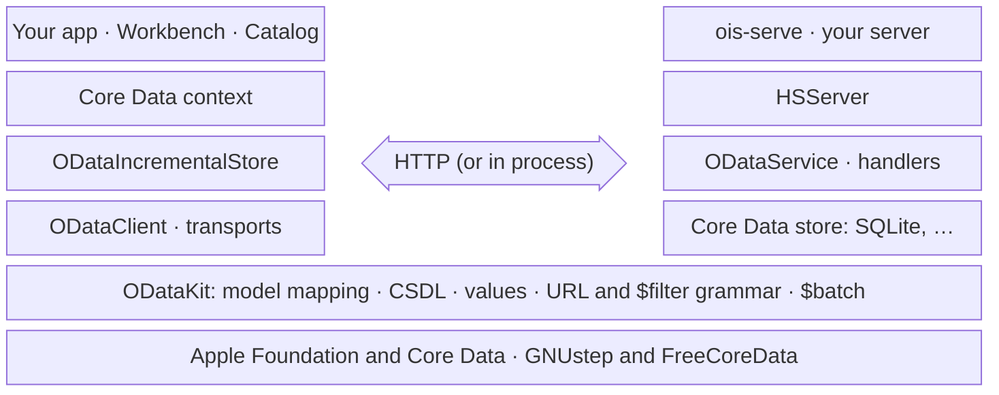
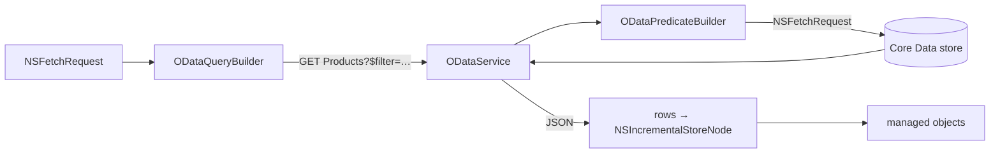

# ODataKit

[](https://github.com/ashalkhakov/ODataKit/actions/workflows/ci.yml)

**OData v4 for Core Data**, in Objective-C, on **macOS and Linux (GNUstep)**.
Both directions: a Core Data store whose rows live in a remote OData service,
and an OData service whose entity sets are a Core Data model. The same
mapping runs each way, so a model written once is a client's model and a
service's schema.

| Library | What it is |
|---|---|
| `ODataIncrementalStore` | The client: an `NSIncrementalStore`. Fetch requests become `$filter`, `$orderby`, `$expand` and the rest; saves become POST, PATCH, DELETE and `$batch`; ETags become merge conflicts. |
| `ODataService` | The server: OData 4.01 (and 4.0) over any Core Data store. `ois-serve` runs it behind a reverse proxy. |
| `ODataKit` | What both share: the model mapping, CSDL, values, the URL and `$filter` grammar, `$filter` and `$orderby` as Core Data predicates and sort descriptors, `$batch`. |
| `HTTPServerKit` | The HTTP server the service runs in, for any API beside it: a pipeline of stages, a router, sign-in (trusted proxy, JWT, token introspection), metrics, JSON logs, readiness, draining. Errors outside OData are `application/problem+json`. |
| `ODataSync` | An offline store: the app works against one local Core Data store; entities the service owns come down by delta links, entities the app collects go up by upsert, entities both edit are reconciled by a conflict policy, and devices can sync with each other through a peer server ([how it works](Source/ODataSync/README.md), [design](docs/offline-sync.md)). |
| `OTelKit` | OpenTelemetry tracing, Foundation only: one trace from an app's fetch through its request to the service's planning and store requests, sent over OTLP to a collector ([observability](docs/observability.md)). |


## Three ways in

Each takes a few minutes. Build the libraries first ([Building](docs/building.md)):
on macOS open `ODataKit.xcworkspace`; on GNUstep, with
[FreeCoreData](https://github.com/ashalkhakov/FreeCoreData) installed, `make && make install`.

### 1. Core Data over an OData service

No model of your own: the store builds one from the service's `$metadata`.
[`Examples/QuickStart/northwind.m`](Examples/QuickStart/northwind.m):

```objc
[ODataIncrementalStore registerStore];
NSURL *url = [NSURL URLWithString:@"https://services.odata.org/V4/Northwind/Northwind.svc/"];
NSManagedObjectModel *model = [ODataIncrementalStore modelForServiceAtURL:url options:nil error:&error];
NSPersistentStoreCoordinator *coordinator = [[NSPersistentStoreCoordinator alloc] initWithManagedObjectModel:model];
[coordinator addPersistentStoreWithType:[ODataIncrementalStore storeType] configuration:nil URL:url options:nil error:&error];

NSFetchRequest *fetch = [NSFetchRequest fetchRequestWithEntityName:@"Product"];
fetch.predicate = [NSPredicate predicateWithFormat:@"unitPrice > 50"];
fetch.sortDescriptors = @[ [NSSortDescriptor sortDescriptorWithKey:@"unitPrice" ascending:NO] ];
fetch.relationshipKeyPathsForPrefetching = @[ @"category" ];
NSArray *products = [context executeFetchRequest:fetch error:&error];
// GET Products?$filter=UnitPrice gt 50&$orderby=UnitPrice desc,ProductID&$expand=Category
```

```sh
# macOS, against the frameworks Xcode built
clang -fobjc-arc -F <build>/Release -framework ODataIncrementalStore -framework ODataKit \
      -framework CoreData -framework Foundation Examples/QuickStart/northwind.m -o northwind
# GNUstep
clang $(gnustep-config --objc-flags) -fobjc-arc -fblocks Examples/QuickStart/northwind.m -o northwind \
      -lODataIncrementalStore -lODataKit -lCoreData $(gnustep-config --base-libs)
./northwind
```

```
Côte de Blaye                  263.5  Beverages
Thüringer Rostbratwurst       123.79  Meat/Poultry
Mishi Kobe Niku                    97  Meat/Poultry
…
```

Then: your own model, saves, conflicts, operations, changes, streams —
[the client guide](docs/client.md).

### 2. A Core Data model as an OData service

`ois-serve` serves a compiled model from a store, here the Catalog example
in SQLite:

```sh
make -C Server                                   # macOS: Server/build/; GNUstep: Server/obj/
Server/build/ois-serve -Model Server/build/Catalog.momd -StoreType SQLite \
                       -StoreURL /tmp/catalog.sqlite -Port 8089
```

or in a container, with the whole Linux stack built in (`Docker/`,
[building](docs/building.md#docker)):

```sh
docker build -f Docker/Dockerfile --target ois-serve -t ois-serve .
docker run -p 8089:8080 -e OIS_SERVICE_ROOT=http://127.0.0.1:8089/odata/ ois-serve
```

```sh
curl http://127.0.0.1:8089/odata/'$metadata'
curl -X POST -H 'Content-Type: application/json' -d '{"CategoryID":1,"CategoryName":"Beverages"}' \
     http://127.0.0.1:8089/odata/Categories
curl -X POST -H 'Content-Type: application/json' \
     -d '{"ProductID":1,"ProductName":"Chai","UnitPrice":18,"Category@odata.bind":"Categories(1)"}' \
     http://127.0.0.1:8089/odata/Products
curl -g 'http://127.0.0.1:8089/odata/Products?$filter=UnitPrice%20gt%2010&$expand=Category($select=CategoryName)&$select=ProductName'
```

```json
{"@odata.context":"http://127.0.0.1:8089/odata/$metadata#Products(ProductName,Category(CategoryName))",
 "value":[{"@odata.etag":"W/\"b4e186aa03e79908\"","ProductName":"Chai","Category":{"CategoryName":"Beverages"}}]}
```

The model's `userInfo` names sets, keys and wire names; handlers change what
a set does; operations are methods declared in a protocol; production runs
behind nginx or Caddy (`Server/Examples/`) — [the server guide](docs/server-design.md).

Routes and pipeline stages of your own go in an `ODataServerApplication`
subclass, with `ois-serve`'s settings and everything it does
(`Server/Examples/CatalogServer.m`):

```objc
@implementation CatalogServer : ODataServerApplication
- (void)configureRouter:(HSRouter *)router
{
  [router insertRoute:[HSRoute routeWithMethod:@"GET" path:@"/stats" handler:stats] atIndex:0];
}
@end

int main(int argc, const char *argv[]) { return HSMain(argc, argv, [CatalogServer class]); }
```

### 3. The Workbench

A window onto both: pick a service (this library's own, in the process, or
Northwind, TripPin, any URL), build a fetch request, and watch every
exchange on the wire. Queries, grouping, `$compute`, `$search`,
application time, streams, saves and conflicts, delta links, asynchronous
requests — each one a preset.

```sh
xcodebuild -workspace ODataKit.xcworkspace -scheme Workbench build   # macOS
make -C Examples/Workbench && openapp Examples/Workbench/Workbench.app   # GNUstep
```

CI packages it on every push (a universal macOS app, a Linux AppImage), and
attaches both to each release — [its README](Examples/Workbench/README.md).

Its Sync window's device also runs on an iPhone ([the Device app](Examples/Device/README.md))
and on a desktop, macOS or Linux ([its desktop counterpart](Examples/DeviceDesktop/README.md)).
Each syncs over the network with a Workbench that serves its built-in service,
and with the other devices nearby ([peer sync](docs/peer-sync.md)).

## What works

- **Reading**: filters (comparisons, `in`, string, date and arithmetic
  functions, `any`/`all`, casts, enumerations), sorting through relationships,
  paging, counts, `$expand` nested with its own options, `$select`, `$search`,
  `$apply` grouping and aggregation, `$compute`, application time.
- **Writing**: inserts, updates and deletes with ETags; relationships by
  `$ref` and `@odata.bind`; a save as one `$batch` change set (multipart, or
  JSON with a 4.01 service); a stale write as a merge conflict the context's
  merge policy settles; repeatable requests.
- **More**: actions and functions as methods; delta links as persistent
  history; asynchronous requests; streams and media entities; models from
  `$metadata` at runtime or generated as a versioned `.xcdatamodeld`.
- **Vocabularies**: Core, Capabilities, Validation, Authorization, Measures,
  Aggregation, JSON, Repeatability, Temporal.
- **Server**: all of the above served over any Core Data store, with limits
  on what one request may ask, authentication as a relying party (OpenID
  Connect, JWTs, a trusted proxy), and 4.0 or 4.01 by what the client asks.
  Reads and writes are planned as a database plans them, and can be
  explained; 4.01's collection writes (`$each`, a delta payload).
- **iOS** (15 and later): the client (ODataKit, ODataIncrementalStore) and
  ODataSync's device side; the service and the peer server are macOS and
  GNUstep only ([building](docs/building.md#ios)).
- **Checked**: against the snapshot suite on every push, both platforms, and
  against Microsoft's public Northwind and TripPin services.

At a glance, how each Core Data idea becomes OData and what runs where:
[How it works](docs/how-it-works.md).

## Limitations

- **Not mapped**: geography and geometry types; a snapshot (hidden) timeline;
  `$index`; `$apply`'s `nest` and hierarchy transformations.
- **Client**: `[d]` (diacritic-insensitive) predicates are refused, since OData
  has no such comparison; a predicate the service cannot filter by is an
  error, not a silent in-memory filter.
- **Server**: `$apply` beyond filters, and ordering by a computed value, run in
  the service's memory (bounded by `maxRowsInMemory`); the rest runs in the
  store.
- **XML (Atom)** payloads are not spoken; JSON only.
- **GNUstep** needs the patched stack from
  [gnustep-patches](https://github.com/ashalkhakov/gnustep-patches) and
  FreeCoreData; the fixes are on their way upstream.

Item by item: [client conformance](docs/odata-conformance.md) and
[server design](docs/server-design.md).

## Architecture



The client is a Core Data store; the server is a Core Data application. Both
stand on ODataKit, so a fetch request and the `$filter` that carries it are
translated by one grammar in both directions, and a service is an
`ODataTransport`: a store can talk to it in process, with no network, as the
tests and the Workbench do.



| Path | What |
|---|---|
| `Source/ODataKit/` | The shared core |
| `Source/ODataIncrementalStore/` | The client store, its HTTP client, model builder, streams |
| `Source/ODataSync/` | Offline sync: the engine and its parts (model, codec, requests, store, clocks), down, up, conflicts, the peer server, the service's part ([README](Source/ODataSync/README.md)) |
| `Source/OTelKit/` | Tracing: spans, sampling, the OTLP exporter |
| `Source/HTTPServerKit/` | The HTTP server: the listener (vendored GCDWebServer), pipeline, router, sign-in, logs and metrics, the application |
| `Source/ODataService/` | The service, its handlers, `$metadata` writer, predicate builder, `$batch`, timelines; `ODataServer.h`, the service as an HTTPServerKit module |
| `Server/` | `ois-serve`, an example application, the loopback check, deployment examples |
| `Examples/` | Workbench, Device (iOS), Catalog, the quick start |
| `Tools/` | `ois-model` (a model from `$metadata`), `ois-filter` |
| `Tests/` | XCTest: snapshots of real services, the service over loopback; `Tests/Live/` against Northwind and TripPin |
| `docs/` | Guides, how it works, conformance, server design |

## Documentation

- [Building](docs/building.md): toolchains, GNUstep, Xcode, tests
- [Client guide](docs/client.md) · [Server guide and design](docs/server-design.md) · [Observability](docs/observability.md) · [Offline sync](docs/offline-sync.md)
- [Query plans](docs/query-plan.md) · [Write plans](docs/write-plan.md): how the service plans reads and writes
- [How it works](docs/how-it-works.md): the mapping, query translation, what runs where
- [Client conformance](docs/odata-conformance.md): OData v4, item by item
- [Workbench](Examples/Workbench/README.md) · [Device (iOS)](Examples/Device/README.md) · [Device (desktop)](Examples/DeviceDesktop/README.md)

## License

LGPL 2.1 or later (`LICENSE`). FreeCoreData is separate, and MIT.
