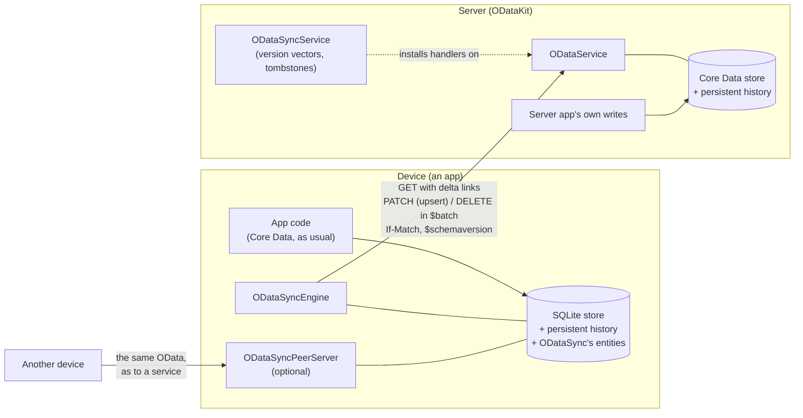
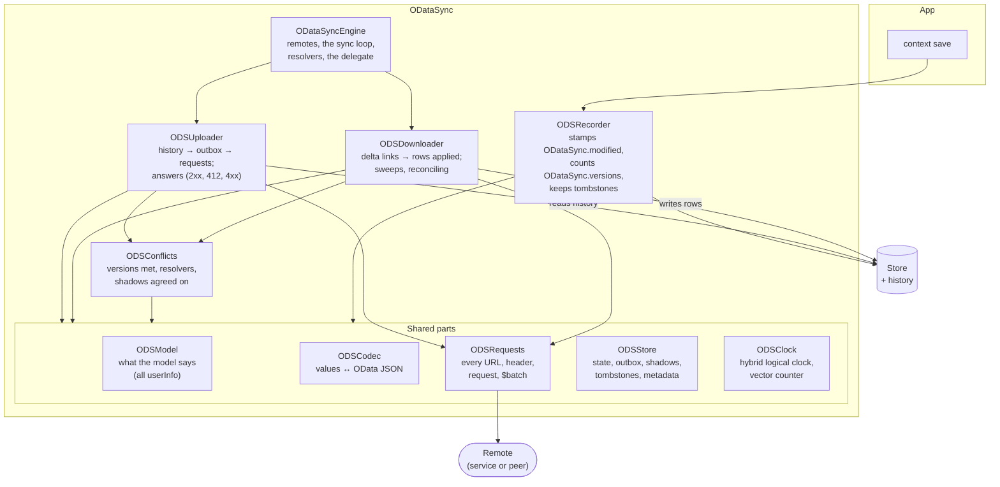
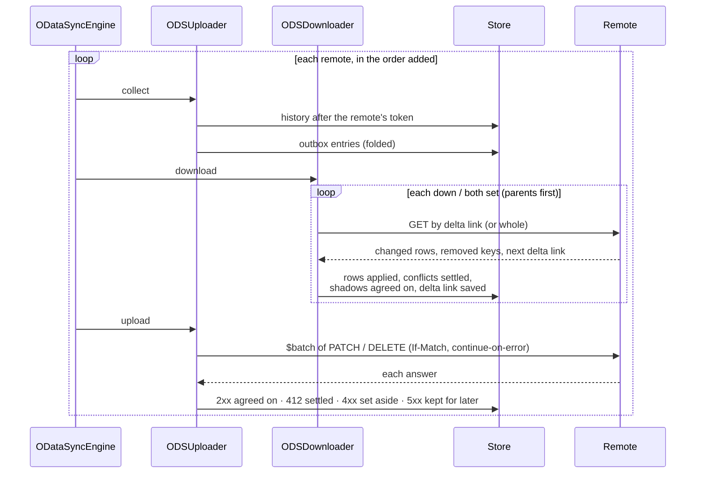
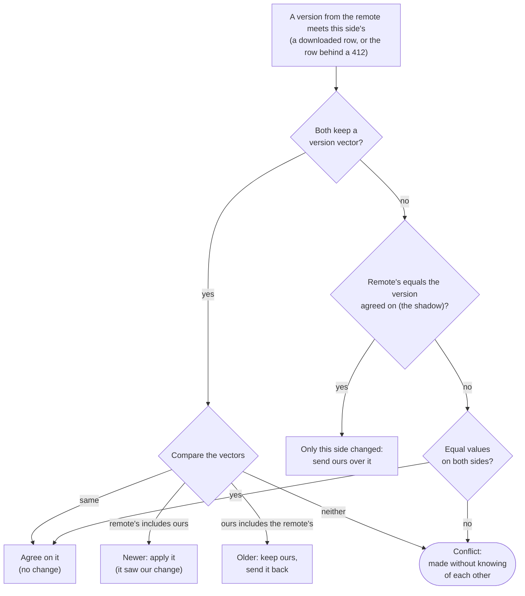
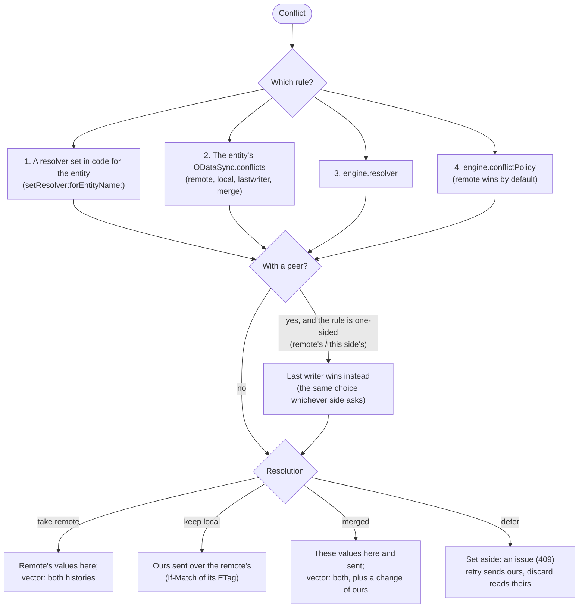

# ODataSync

An offline Core Data store kept in sync with an OData service. The app
works against one local store, as any Core Data app does; ODataSync brings
down what the service owns, sends up what the app collects, settles what
both changed, and lets devices sync with each other when the service is
out of reach.

It is built on what ODataKit already is: the OData client
(`ODataClient`, the property mapper, the value coder), the server
(`ODataService`, its delta links, upserts and `$batch`), and Core Data's
persistent history (Apple's and FreeCoreData's). The design, with the
reasons for each choice, is [docs/offline-sync.md](../../docs/offline-sync.md);
this page is how it is put together.

- [Where it sits](#where-it-sits)
- [Which way each entity goes](#which-way-each-entity-goes)
- [The client side](#the-client-side)
- [A sync](#a-sync)
- [How conflicts are found](#how-conflicts-are-found)
- [How conflicts are resolved](#how-conflicts-are-resolved)
- [Integrating](#integrating)
- [The files](#the-files)
- [Tests](#tests)

## Where it sits



- **The service** is a plain OData service: delta links from persistent
  history (`Prefer: odata.track-changes`), upserts (a `PATCH` to a key that
  does not exist creates it), ETags and `If-Match`, JSON `$batch` with
  `odata.continue-on-error`. ODataKit's `ODataService` has all of it; an
  app that serves its data with it gets the server half by configuration.
  Another OData service that has them works too.
- **`ODataSyncService`** is the optional server part of the causal history:
  it compares the version vector a write carries with what the service has,
  keeps tombstones of deleted keys, and counts the server app's own changes.
  Without it, devices still compare versions among themselves; with it, a
  late copy of a deleted object cannot bring it back.
- **Devices** keep one SQLite store with persistent history. The engine
  adds its own entities to the app's model: each remote's state, the
  outbox, the versions both sides last agreed on (shadows), and tombstones.
- **Peers**: a device may serve its store (`ODataSyncPeerServer`, an
  `ODataService` on HTTPServerKit); another adds it as a remote and syncs
  with it as with the service. What came from one remote is passed on to
  the others, never back. Between devices on a local network: TLS with each
  device's certificate, Bonjour, and trust by the service's peer tokens or
  by pairing ([peer sync](../../docs/peer-sync.md)).
- **Schema versions**: `$metadata` says the service's (`Core.SchemaVersion`)
  and each request names the device's (`$schemaversion`); a service on a
  newer model can read what an older device sends (`ODataService.upgradeBody`).

## Which way each entity goes

Each synced entity says so in its `userInfo`:

| `ODataSync.direction` | Who owns it | Down (service → device) | Up (device → service) |
|---|---|---|---|
| `down` | the service | read whole, then by delta link; removals applied | never (a local change is reported to the delegate) |
| `up` | the device (UUID keys) | never | upsert, so sending again is harmless |
| `both` | either | as `down` | as `up`, with `If-Match` of the version agreed on: a conflict when both changed it |
| *(none)* | the app alone | — | — |

With a **peer**, `up` entities go both ways like `both`; a peer is no
authority, so what it reads deletes nothing here, and from it `down`
entities only fill in what is missing (or a newer version, by their
`OData.etag` counter).

Other keys: `ODataSync.conflicts` (the rule for a `both` entity),
`ODataSync.modified` (the stamp last writer wins orders by) and
`ODataSync.versions` (the version vector).

## The client side



- **Every save** passes through `ODSRecorder` (a will-save observer): the
  app's changes get a stamp and a count of this replica's changes in their
  version vector; deletions leave a tombstone. Saves the engine makes
  (authored `ODataSync.down.<remote>`) are not stamped again.
- **Up**: the outbox is filled from the store's persistent history after
  each remote's token, so the engine never misses a change and never needs
  the app to tell it. Changes to one object are folded into one entry.
- **Down**: each set is read whole the first time with change tracking,
  then by its delta link; a `410 Gone` (the link expired, or the scope
  changed) reads it whole again and sweeps what the remote no longer has.
- **One place each**: `ODSModel` reads the model (and so every
  `ODataSync.*` key), `ODSCodec` turns objects into OData values and back,
  `ODSRequests` builds every request, `ODSStore` keeps every piece of the
  engine's own state.

## A sync



Collecting first means a change the device has not sent yet is known when
the download meets the remote's version of the same object: it is a
conflict, not something to overwrite or sweep.

## How conflicts are found

A conflict is a version changed here and at a remote since the version
both last agreed on. Versions meet in two places: a downloaded row of an
object with a pending change, and a `412 Precondition Failed` to an upload's
`If-Match` (the engine then reads the remote's row).



- **Version vectors** (`ODataSync.versions`) record, for each replica that
  changed an object, the number of that replica's latest change the version
  includes (`Kq3x9Zp1.4f,svc.2a`). Two versions compare as git commits do:
  one includes the other, or neither does. Without vectors the engine
  falls back to the shadow (the version agreed on, ETag and values) and to
  the stamps.
- **Deletions** keep the deleted version's vector. An insert or update of a
  deleted key that the deletion had seen is late (refused, `410`); one
  made without knowing of the deletion is a conflict (`409`, the deletion's
  vector in the error's details), delete against change.
- **Peers** never delete by reading; an older copy from a peer is not
  applied, and this side's goes back to it.

## How conflicts are resolved



| Rule | What stands |
|---|---|
| `ODataSyncRemoteWins` (default) | the service's version |
| `ODataSyncLocalWins` | this device's version |
| `ODataSyncLastWriterWins` | the later `ODataSync.modified` stamp (a hybrid logical clock, so devices with wrong clocks still order causally); a delete loses to a change |
| `ODataSyncMergeFields` | each property from the side that changed it; a property both changed, by a fallback rule |
| your own `ODataSyncResolving` | anything, including defer; `conflict.withPeer` says when it must choose the same whichever side asks |

Every resolution leaves a version whose vector includes both histories, so
the remote takes it for newer and the conflict is not met again.

## Integrating

On the device:

```objc
NSManagedObjectModel *model = ...;                 // ODataSync.direction (and .versions) in userInfo
[ODataSyncEngine addBookkeepingToModel:model configuration:nil];
// the store: SQLite, with NSPersistentHistoryTrackingKey
ODataSyncEngine *sync = [[ODataSyncEngine alloc] initWithCoordinator:coordinator];
ODataSyncRemote *service = [ODataSyncRemote remoteWithServiceRoot:url];
service.configuration.credentialProvider = auth;   // ODataCredentialProviding
service.filters = @{ @"Asset": @"Region eq 'North'" };
[sync addRemote:service];
sync.resolver = [[ODataSyncMergeFields alloc] init];
sync.delegate = self;                              // changes set aside, local edits of down entities
[sync syncWithTarget:self action:@selector(syncDidFinish:error:)];
// what waits to be sent: sync.pendingChanges; what was refused: sync.issues
```

On the server (ODataKit), for version vectors and tombstones:

```objc
[ODataSyncService addBookkeepingToModel:model configuration:nil];
ODataService *service = ...;                       // persistent history on its store
ODataSyncService *histories = [[ODataSyncService alloc] initWithService:service];
service.upgradeBody = ^NSDictionary *(NSDictionary *body, NSString *version, NSEntityDescription *entity,
                                      ODataRequest *request, NSError **error) {
  return body;                                     // older devices' writes, made this model's
};
```

A device that offers its store to others:

```objc
ODataSyncPeerServer *peers = [[ODataSyncPeerServer alloc] initWithEngine:sync host:@"192.168.1.20" port:8642];
peers.service.authenticator = ...;
[peers start:&error];                              // others: +[ODataSyncRemote peerWithServiceRoot:]
```

The Workbench has all of it to try (Sync > Show Device): a device beside
its built-in service, its outbox, the conflicts it meets, its requests.

## The files

| File | What it does |
|---|---|
| `include/ODataSync/ODataSyncEngine.h` | the public API: the engine, remotes, changes and issues, conflicts and resolvers |
| `include/ODataSync/ODataSyncPeerServer.h` | a device's store served to its peers |
| `include/ODataSync/ODataSyncPeerTokens.h` | peer tokens the service issues (`ODataSyncPeerTokenIssuer`) |
| `include/ODataSync/ODataSyncPeerIdentity.h` | a device's key pair and certificate, its thumbprint |
| `include/ODataSync/ODataSyncPeerListener.h` | TLS in front of the peer server, the client's certificate noted |
| `include/ODataSync/ODataSyncPeerTrust.h` | whom a device syncs with: tokens, pairings |
| `include/ODataSync/ODataSyncPeerTransport.h` | a remote's way to a peer over TLS, the peer checked; pairing |
| `include/ODataSync/ODataSyncPeerDiscovery.h` | Bonjour: advertising and browsing for peers |
| `include/ODataSync/ODataSyncService.h` | the server's part: `ODataSyncService`, `ODataSyncSetHandler` |
| `ODataSyncEngine.m` | orchestration: remotes in turn, the sync loop, resolvers, the outbox's API |
| `ODataSyncRemote.m`, `ODataSyncChange.m` | the public value classes |
| `ODSModel.{h,m}` | what the model says: directions, synced properties, keys, every `ODataSync.*` key |
| `ODSCodec.m` | objects ↔ OData JSON and values; keys; version vectors of an object or a row |
| `ODSRequests.{h,m}` | every request: set and row reads, upserts and deletions with their conditions, `$batch`, `$schemaversion` |
| `ODSStore.{h,m}` | the engine's entities and metadata: remote state, outbox, shadows, tombstones, replica ID |
| `ODSClock.{h,m}` | the hybrid logical clock and the vector counter |
| `ODSRecorder.{h,m}` | the save observer: stamps, vectors, tombstones |
| `ODSDownloader.m` | down: delta links, rows applied, sweeps, reconciling keys |
| `ODSUploader.m` | up: history into the outbox, requests sent, answers taken |
| `ODSConflicts.m` | conflicts: versions met, resolvers, resolutions applied |
| `ODSVersions.m` | version vectors: text, comparison, merging |
| `ODataSyncPeerServer.m`, `ODataSyncService.m` | the peer server and the service's part |
| `ODataSyncPeer*.m` | peers: identity, trust, transport, discovery, tokens, as the system interface below gives them |
| `ODSSystem.h` | what peers need of the system: hashing, random bytes, the identity's keeping, an HTTPS client of a peer |
| `apple/` | ODSSystem on Apple platforms (Security, URLSession) and the listener (Network.framework); the Xcode project builds it |
| `linux/` | ODSSystem on Linux (GnuTLS, libcurl) and the listener (GnuTLS over sockets); the GNUmakefiles build it |

What differs from system to system is in `apple/` and `linux/`, one
directory each, which the build picks; the rest has no `#if` for it. The
whole of ODataSync builds on macOS, iOS and GNUstep.

## Tests

- `Tests/ODataSyncTests.m`: each behaviour, against an `ODataService` in
  the process.
- `Tests/ODataSyncConvergenceTests.m`: every conflict under every rule (on
  download and on 412), and devices, peers and the service changing data
  at random and syncing in random orders until they agree; with and without
  version vectors. `ODATASYNC_SEEDS=1000` for a long run.
- `Server/Tests/ois-serve-check.m`: sync over HTTP (`offline-sync`,
  `-conflicts`, `-peers`, `-versions`), on macOS and on GNUstep
  (`docker build -f Docker/Dockerfile --target check .`; the unit tests:
  `--target unit`).
